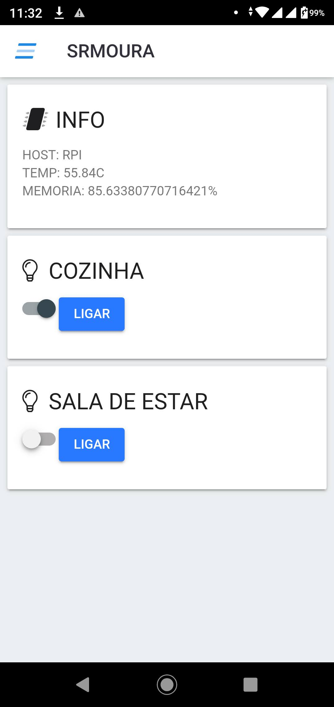
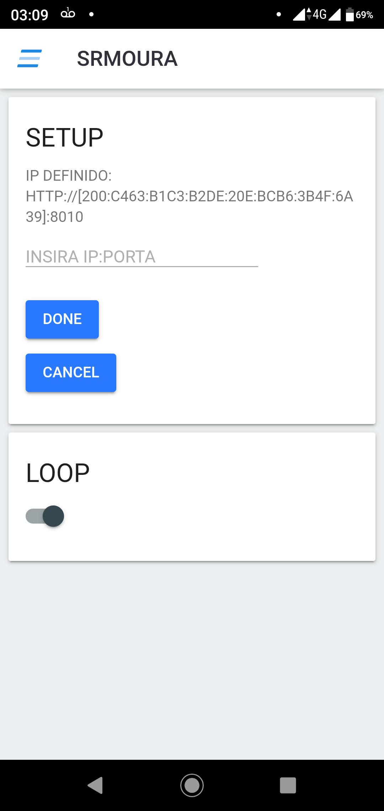

# Projeto de Automação Residencial

Criado em : 25/Jul/2020

# Objetivo
Construir uma aplicação simples para consumo de uma API escrita em Go para controle de GPIO em RaspBerry PI.

# Tecnologias
- Cordova - Phonegap
- Bower
- FontAwesome
- OnsenUI

